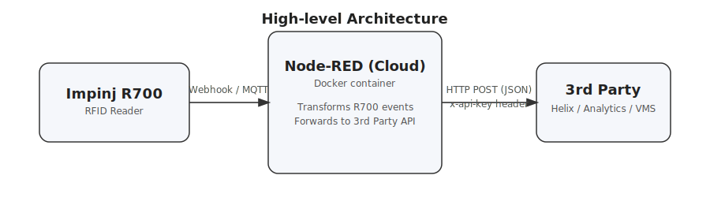
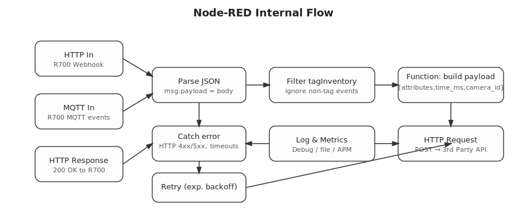
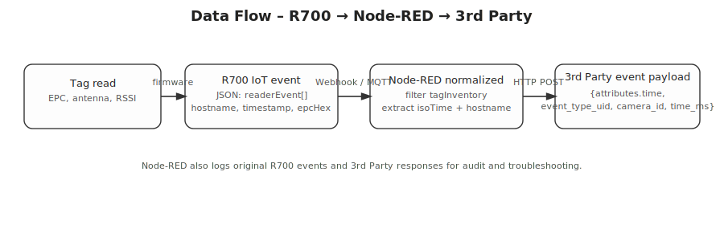
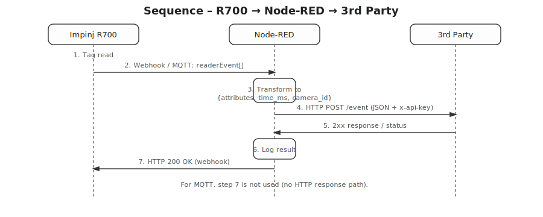

# 🚀 Impinj R700 → Node-RED → 3rd Party Integration

A reference architecture and Dockerized Node-RED project to receive RFID events from an **Impinj R700** reader (via **Webhook** or **MQTT**), normalize the payload, and forward events to any **3rd Party HTTP API** using a secure API key.

This project includes:

* ✔ Production-ready Node-RED flow
* ✔ Docker & Docker Compose deployment
* ✔ Exponential-backoff retry logic
* ✔ Event logging
* ✔ ISO-timestamp normalization
* ✔ SVG architecture diagrams for documentation

---

# 📁 Repository Structure

```
.
├── docker-compose.yml
├── Dockerfile
├── data/
│   └── flows.json          # Full Node-RED flow
└── images/
    ├── high-level.svg
    ├── node-red-internal-flow.svg
    ├── data-flow.svg
    └── sequence-r700-node-red-3rdparty.svg
```

---

# 🖼 Architecture Diagrams

## **High-Level Architecture**



This shows the full workflow:
**R700 → Node-RED (cloud) → 3rd Party API**

---

## **Node-RED Internal Flow**



This represents the exact logic implemented inside Node-RED, including:

* Webhook/MQTT ingestion
* JSON parsing
* Filtering and transformation
* Logging
* Retry and error handling
* HTTP POST to the 3rd party endpoint

---

## **Data Flow**



Shows the transformation path from:

* Raw EPC read
* R700 `readerEvent[]` JSON
* Normalized Node-RED payload
* Final 3rd-party JSON schema

---

## **Sequence Diagram**



Detailed timeline of message exchange between:

1. **R700 RFID Reader**
2. **Node-RED**
3. **3rd Party API**

---

# 🧠 How It Works

### 1️⃣ Impinj R700 Emits Events

The reader is configured to send tag read events via:

* **Webhook (HTTP POST)**
* **MQTT (publish to broker)**

Events match the R700 IoT JSON schema (hostname, timestamp, EPC, etc.).

---

### 2️⃣ Node-RED Receives the Event

The flow automatically:

* Parses the event batch
* Splits individual events
* Filters for `tagInventory`
* Extracts:

  * EPC
  * hostname (used as `camera_id`)
  * ISO timestamp

---

### 3️⃣ Payload Normalization

Events are transformed into the required 3rd-party schema:

```json
{
  "attributes": { "time": "{ISO8601}" },
  "event_type_uid": "ed857b63-e1ef-4aa5-911e-c453408708e4",
  "camera_id": "{READER_HOSTNAME}",
  "time_ms": 1234567890123
}
```

---

### 4️⃣ Secure Forwarding

Node-RED sends the final payload using:

```
HTTP POST + x-api-key
```

API key is injected via environment variable:

```
EXTERNAL_API_KEY=your_key_here
```

---

### 5️⃣ Reliability

The flow includes:

* Error capture
* Exponential backoff retry
* Logging of events & errors
* Guaranteed `200 OK` back to R700 webhook

---

# 🏗 Deployment Instructions

## 1. Install Docker & Docker Compose

Ubuntu example:

```bash
sudo apt update
sudo apt install docker.io docker-compose
```

---

## 2. Clone the Repository

```bash
git clone https://github.com/your/repo.git
cd repo
```

---

## 3. Create `.env`

```
EXTERNAL_API_KEY=your_api_key_here
```

Replace with your real 3rd-party token.

---

## 4. Start the Stack

```bash
docker compose up -d
```

Node-RED will be available at:

👉 **[http://localhost:1880](http://localhost:1880)**
(or your cloud server’s IP)

---

## 5. Verify Flow Load

Node-RED automatically loads:

```
data/flows.json
```

If you modify the flow manually, restart the container:

```bash
docker compose restart
```

---

# 🔧 R700 Configuration

### **Webhook Mode**

Set:

```
http://<your-server-ip>:1880/impinj
```

Enable event forwarding for:

* Tag Inventory
* Reader Hostname
* EPC (Hex recommended)
* Timestamp

---

### **MQTT Mode**

Configure:

* Broker host
* Username/password (if applicable)
* `eventTopic`
* QoS

Then connect Node-RED’s MQTT-In node to that topic.

---

# 📌 Notes

* All diagrams are vector-based SVG — beautifully scalable in GitHub docs.
* Flows include exponential retry and error-handling by design.
* Reader hostname is intentionally used as the `camera_id` field.

---

# 🙌 Contributing

PRs welcome!
Ideas for improvements:

* Add authentication to webhook endpoint
* Add Grafana dashboard
* Store event logs in InfluxDB or MongoDB
* Add support for batch-mode forwarding

---

